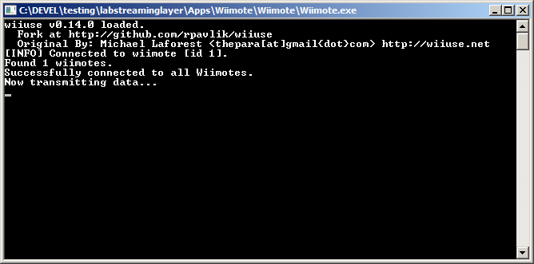
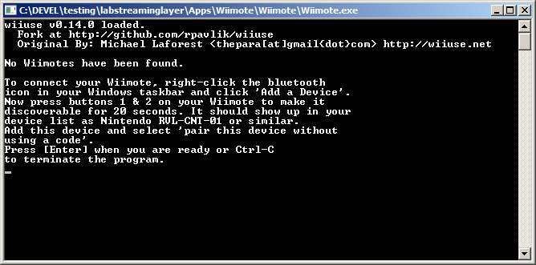

# Wiimote App for labstreaminglayer

The Wiimote application comes with the full LSL distribution. This program should work with any Wiimote and any official expansion (Nunchuk, Classic Controller, Guitar Hero 3 Controller, Balance Board) by Nintendo (http://www.nintendo.com/). The program provides two streams, one for button-press events and another one for the position and motion sensors. The program uses Bluetooth to connect to the Wiimote, so your computer must have a working Bluetooth adapter (e.g., dongle). We recommend that you use Bluetooth hardware that is natively supported by your Windows, instead of installing a third-party Bluetooth stack (such as BlueSoleil, although it should work as well). In theory the program should work with multiple remotes simultaneously, although this has not yet been tested.

## Usage instructions

The app executable will be in a sister directory to your LSL install. It should have all the necessary libraries with it.

### Windows - Pair devices in advance

First pair your device to the PC. To do so, go into the Bluetooth settings,
let it scan for devices while you tap the little orange button under the
battery cover on your device. Eventually you should see a device named
something like "Nintendo RVL-CNT-01". Click on the device then click on pair.
It may ask you for a code, leave this empty then press next.
If the pairing dialog does not close immediately, cancel to close it yourself
after about 1 second. The bluetooth manager will continue to pair. Make sure
the device does not turn off during this process by pressing the 1+2 buttons
on the face. The pairing progress bar should complete and the device should be
listed as paired. The LEDs may continue to flash even after pairing.

Now you may run with Wiimote executable. When you press "Link", it will
connect to up to 4 Wii devices that are paired and connected to your system.

If your Wiimote had been paired successfully the remote will emit a short hum and you will see a console window like the following.

> 

Otherwise the app will keep prompting you to first pair the Wiimote and then confirm with Enter until the bluetooth connection has succeeded.

> 

### Mac

The Wii-device communication library [wiiuse](https://github.com/rpavlik/wiiuse)
has a bit of a strange way of accessing the Wii devices in Mac. The device
cannot be paired to the system prior to use. If you have already paired the
device then you'll have to open your Bluetooth preferences and remove it.

The device also must not be connected. Click on the bluetooth icon in the
menu bar. If any Nintendo devices are listed there then select them and
click on 'disconnect'.

You may now run Wiimote.app by double-clicking on it.
A little GUI will appear with a link button. Do not press it yet.
Put all the devices you wish to record from in discoverable mode
by pressing the orange button on the inside of the battery cover.
While they are still in discoverable model, click on the Link button.

### Further Info

You should now have two streams on your lab network, one with name "WiimoteMarkers0" and type "Markers" and another one with name "!wiimoteSensors0" and type "Mocap".

The marker stream has a single channel that contains string-formatted samples (at irregular rate). The events are of the form "ButtonName pressed" and "ButtonName released". The sensors stream also has irregular rate (since the remote only sends updates when the values have actually changed) and the number of channels depends on the expansions that you have connected. Take a look at the stream meta-data to identify their meaning.

## Building

### Dependencies

    * cmake
    * Qt5
    * Compiler (+ IDE)
        * Tested with Visual Studio 2015 32-bit and 64-bit, Xcode clang
    * Windows-only:
        * [WinHID](https://developer.microsoft.com/en-us/windows/hardware/download-kits-windows-hardware-development)
            * You may already have this installed with Visual Studio.

### Build Instructions

On Mac/Linux

```
mkdir build && cd build
cmake -DLSL_ROOT=path/to/labstreaminglayer/build/lsl_Release/lslinstall/LSL ..
make
make install
```

On Windows, the cmake command needs the Qt5_DIR and the generator if Win64 specified as well. e.g.,
(modify below with your Qt5 dir and LSL install dir)

```
mkdir build && cd build
cmake -DQt5_DIR=C:\Qt\5.9.1\msvc2015_64\lib\cmake\Qt5 -DLSL_ROOT=D:\full\path\to\labstreaminglayer\build\lsl_Release\lslinstall\LSL -G "Visual Studio 14 2015 Win64" ..
```

Then open up the visual studio solution, change the Solution Configuration drop down to Release, right click on the INSTALL target, then Build.


